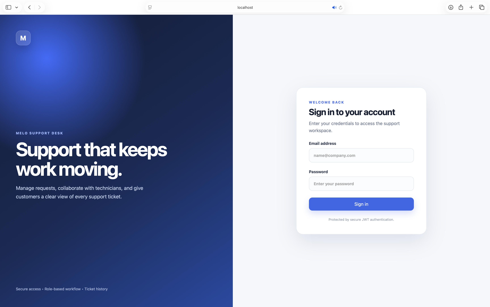
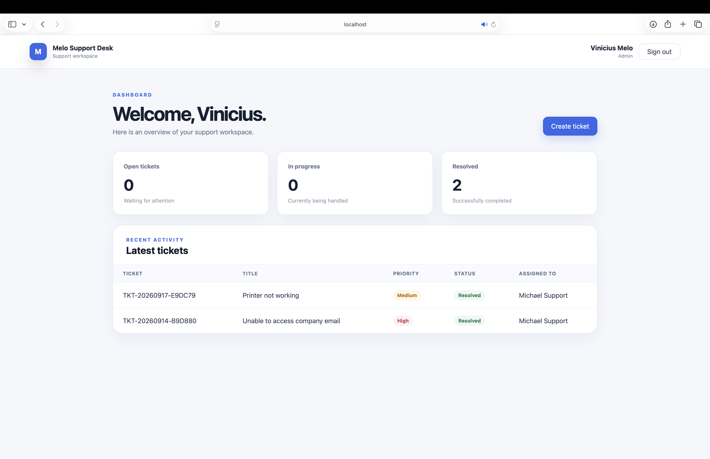

# Melo Support Desk

A full-stack support ticket management system built with ASP.NET Core, React, TypeScript, and PostgreSQL.

The application provides role-based workflows for administrators and technicians, including ticket creation, assignment, status management, dashboards, and workload monitoring.

## Screenshots

### Login



### Administrator dashboard


### Technician dashboard



## Features

### Administrator

- Secure JWT authentication
- Dashboard with ticket metrics
- Create support tickets
- View recent tickets
- Assign tickets to technicians
- Update ticket status
- View ticket details
- Manage technician accounts

### Technician

- Dedicated role-based dashboard
- View assigned tickets
- Monitor current workload
- Update ticket status
- Track tickets in progress and resolved tickets

## Technology Stack

### Backend

- .NET 10
- ASP.NET Core Web API
- Entity Framework Core
- PostgreSQL
- JWT Bearer Authentication
- OpenAPI

### Frontend

- React
- TypeScript
- Vite
- Axios
- React Router
- CSS

## Project Structure

```text
MeloSupportDesk/
├── docs/
│   └── screenshots/
├── src/
│   ├── MeloSupportDesk.Api/
│   │   ├── Controllers/
│   │   ├── Data/
│   │   ├── Models/
│   │   ├── Services/
│   │   └── Program.cs
│   └── MeloSupportDesk.Web/
│       └── src/
│           ├── api/
│           ├── auth/
│           ├── components/
│           ├── pages/
│           └── types/
└── README.md
```

## Requirements

Before running the project, install:

- .NET 10 SDK
- Node.js and npm
- PostgreSQL
- Entity Framework Core CLI

Install the EF Core CLI if necessary:

```bash
dotnet tool install --global dotnet-ef
```

## Configuration

The API uses .NET User Secrets for sensitive configuration. From the repository root, configure the database and JWT settings:

```bash
dotnet user-secrets set \
  "ConnectionStrings:DefaultConnection" \
  "Host=localhost;Port=5432;Database=melo_support_desk;Username=postgres;Password=YOUR_PASSWORD" \
  --project src/MeloSupportDesk.Api
```

```bash
dotnet user-secrets set \
  "Jwt:Key" \
  "YOUR_LONG_RANDOM_SECRET_KEY" \
  --project src/MeloSupportDesk.Api
```

```bash
dotnet user-secrets set \
  "Jwt:Issuer" \
  "MeloSupportDesk.Api" \
  --project src/MeloSupportDesk.Api
```

```bash
dotnet user-secrets set \
  "Jwt:Audience" \
  "MeloSupportDesk.Web" \
  --project src/MeloSupportDesk.Api
```

Do not commit passwords, JWT keys, database credentials, or access tokens.

## Demo Accounts

In the Development environment, the API can automatically create administrator and technician demo accounts.

Configure the demo password using .NET User Secrets:

```bash
dotnet user-secrets set \
  "DemoUsers:Password" \
  "DemoSupport2026!" \
  --project src/MeloSupportDesk.Api

Start the API after applying the database migrations. The following accounts will be created automatically if they do not already exist:

| Role | Email | Password |
|---|---|---|
| Administrator | `admin@melosupportdesk.local` | `DemoSupport2026!` |
| Technician | `technician@melosupportdesk.local` | `DemoSupport2026!` |

Demo users are created only when the API runs in the Development environment. Production credentials must be managed separately and must never be committed to Git.


## Running the Project

### 1. Restore and build the backend

```bash
dotnet restore
dotnet build
```

### 2. Apply database migrations

```bash
dotnet ef database update \
  --project src/MeloSupportDesk.Api
```

### 3. Start the API

```bash
dotnet run \
  --project src/MeloSupportDesk.Api
```

Keep this terminal running.

### 4. Install frontend dependencies

Open another terminal:

```bash
npm install --prefix src/MeloSupportDesk.Web
```

### 5. Start the frontend

```bash
npm --prefix src/MeloSupportDesk.Web run dev
```

Open the URL displayed by Vite in your browser.

## Quality Checks

Run the backend build:

```bash
dotnet build
```

Run the frontend linter:

```bash
npm --prefix src/MeloSupportDesk.Web run lint
```

Create a production frontend build:

```bash
npm --prefix src/MeloSupportDesk.Web run build
```

## Security

- Passwords are stored as secure hashes.
- Protected endpoints require JWT authentication.
- Authorization is based on user roles.
- Sensitive local configuration is stored with .NET User Secrets.
- Credentials and tokens should never be committed to Git.

## Roadmap

- Automated backend and frontend tests
- Docker and Docker Compose support
- Ticket comments and activity history
- Search, filtering, and pagination interface
- Email notifications
- AI-assisted ticket classification
- Production deployment and CI/CD

## Author

Developed by **Vinicius Melo** as a full-stack portfolio project.

## License

This project is available for portfolio and educational purposes.
